# mini-minecraft-optifine

By **Yueyang Li, Renzhen, Jiangxu Xing"


- [mini-minecraft-optifine](#mini-minecraft-optifine)
- [Control:](#control)
- [Mile Stone 1 report:](#mile-stone-1-report)
  - [1. Efficient Terrain Rendering and Chunking - By Zhen Ren](#1-efficient-terrain-rendering-and-chunking---by-zhen-ren)
  - [2. Terrain Generation - By Yueyang Li](#2-terrain-generation---by-yueyang-li)
    - [Overview](#overview)
    - [Features](#features)
    - [Installation](#installation)
    - [Usage](#usage)
    - [API Reference](#api-reference)
  - [3. Game Engine Physics - By Jiangxu Xing](#3-game-engine-physics---by-jiangxu-xing)
    - [Features](#features-1)
- [Mile Stone 2 report:](#mile-stone-2-report)
  - [1. Cave Systems](#1-cave-systems)
    - [Using Perlin Noise 3D to generate Cave system](#using-perlin-noise-3d-to-generate-cave-system)
    - [Postprocess Shader for Lava \& Water](#postprocess-shader-for-lava--water)
  - [2. Texturing and Texture Animation](#2-texturing-and-texture-animation)
    - [Texteuring](#texteuring)
    - [Texture Animation](#texture-animation)
    - [Transparent Rendering](#transparent-rendering)
    - [Wire Frame rendering](#wire-frame-rendering)
    - [Postprocessing Pipeline](#postprocessing-pipeline)
  - [3. Multithreaded Terrain Generation - By Jiangxu Xing](#3-multithreaded-terrain-generation---by-jiangxu-xing)
    - [General std Thread Pool:](#general-std-thread-pool)
    - [Multithreaded terrain generation:](#multithreaded-terrain-generation)
    - [Player Physics in water:](#player-physics-in-water)
    - [Game timeline specifies:](#game-timeline-specifies)
- [Mile Stone 3 Report](#mile-stone-3-report)
- [Zhen Ren](#zhen-ren)
  - [Deferred Rendering Pipeline](#deferred-rendering-pipeline)
  - [Day Night Lighting System](#day-night-lighting-system)
    - [Dynamic Lighting](#dynamic-lighting)
    - [Atmospheric Sky](#atmospheric-sky)
    - [Volumetric Cloud](#volumetric-cloud)
  - [Cascaded Shadow Maps](#cascaded-shadow-maps)
  - [Volumetric Light](#volumetric-light)
  - [Water Improvements](#water-improvements)
    - [Water Wave](#water-wave)
    - [Distance Based Alpha](#distance-based-alpha)
    - [Screen Space Reflection (SSR)](#screen-space-reflection-ssr)
  - [Plants Rendering](#plants-rendering)
    - [Plants Precise Shadow](#plants-precise-shadow)
    - [Plants Wave](#plants-wave)
    - [Transparent Leaf](#transparent-leaf)
  - [Distance Fog](#distance-fog)
  - [Procedural Birch Forest](#procedural-birch-forest)
  - [Procedural Lake Sword](#procedural-lake-sword)
- [Jiangxu Xing](#jiangxu-xing)
  - [Frustum Culling](#frustum-culling)
  - [Deferred Rendering Pipeline \& Post-Processing Pipeline](#deferred-rendering-pipeline--post-processing-pipeline)
    - [G-Buffer](#g-buffer)
    - [Bilateral Filter](#bilateral-filter)
    - [Screen Space Ambient Occlusion (SSAO)](#screen-space-ambient-occlusion-ssao)
    - [Distance Fog \& Height Fog](#distance-fog--height-fog)
    - [Screen Space Multiple Scattering (SSMC)](#screen-space-multiple-scattering-ssmc)
    - [Motion Blur](#motion-blur)
    - [Post-process sky integration](#post-process-sky-integration)
    - [More post-processing shader](#more-post-processing-shader)
      - [Hatching](#hatching)
      - [Bloom](#bloom)
      - [Outline](#outline)
      - [Posterization](#posterization)
  - [Video recording Helper](#video-recording-helper)
    - [Photo Mode (KEY C)](#photo-mode-key-c)
    - [Adjusting rendering time scale](#adjusting-rendering-time-scale)
    - [Render pass breakdown (KEY 1)](#render-pass-breakdown-key-1)
  - [Loading CG](#loading-cg)
- [Yueyang Li](#yueyang-li)
  - [More Vibrant Ground Terrain Biome](#more-vibrant-ground-terrain-biome)
  - [L-system](#l-system)
    - [L-System Generated River](#l-system-generated-river)
    - [L-system Generated Tree](#l-system-generated-tree)
  - [Under Water and Lava Shader](#under-water-and-lava-shader)
  - [Procedurally placed flowers and grass](#procedurally-placed-flowers-and-grass)
  - [Procedurally generated and placed trees, flowers, and other assets](#procedurally-generated-and-placed-trees-flowers-and-other-assets)
  - [](#)
  
# Control:

  - **W** -> Accelerate positively along forward vector
  - **S** -> Accelerate negatively along forward vector
  - **D** -> Accelerate positively along right vector
  - **A** -> Accelerate negatively along right vector
  - **E** -> Accelerate positively along up vector
  - **Q** -> Accelerate negatively along up vector
  - **SHIFT** -> Speed UP

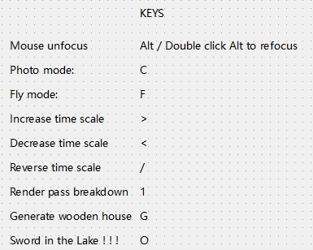


# Mile Stone 1 report:

**Video Link**: https://drive.google.com/file/d/157vypFibGE7UbERzrUInaGsvjUVASQkP/view?usp=sharing

---

## 1. Efficient Terrain Rendering and Chunking - By Zhen Ren

  Insert only visible faces to VBO

  Use interleaved buffer structure

  Use Terrain generation zone to load and render adjacent chunks.

  Use multi-frames to create chunk data and VBO data.


---

## 2. Terrain Generation - By Yueyang Li

### Overview
TerrainGenerator is a versatile C++ library for procedural terrain generation. It leverages various noise generation techniques, such as Perlin and Worley noise, to create realistic and diverse terrain landscapes. This library is ideal for game developers, simulation creators, and anyone interested in procedural content generation.
Most of the functionality of Terrain Generation is listed as the static library in the TerrainGenerator Class, but coupled API for Chunk worker, and type justification is implemented in the **Terrain** class, which is designed to stay there for future multi-threaded work.

### Features
- **Multiple Noise Types**: Supports Perlin, Worley, and normal noise algorithms.
- **Flexible Terrain Generation**: Capable of generating grasslands, deserts, and mountain terrains.
- **Customizable Noise Parameters**: Adjust noise parameters for varying terrain features.
- **Math Helper Functions**: Includes a namespace `mathPack` with functions like `vecpow` and `intervalRemapper`.

### Installation
To use the TerrainGenerator in your project, include the `terraingenerator.h` file in your C++ project. Ensure you have the GLM library as it's a dependency for the vector and matrix calculations.

### Usage
Here's a simple example of how to use the TerrainGenerator:

```cpp
#include "terraingenerator.h"

int main() {
    TerrainGenerator terrainGen;
    int height = terrainGen.getHeight(10, 20); // static, can be called everywhere in the program life
    // Use the height for terrain rendering or other purposes
}
```

### API Reference
The main functionalities provided by the TerrainGenerator include:
- **Height Calculation**: Functions like `getHeight`, `getGrassHeight`, `getDesertHeight`, and `getMountainHeight` for different terrain types.
- **Noise Generation**: `noise1D`, `noise2D`, `smoothNoise2D`, and `fbm2D` for generating 1D and 2D noise.
- **Interpolation**: `linearInterp` and `cosineInterp` for smooth transitions.
- **Worley Noise**: `voronoiCenter` and `worleyNoise` for Worley noise generation.

---
## 3. Game Engine Physics - By Jiangxu Xing


### Features
 - **Player input handler**: Handle user input
 - **Rigidbody**: Maintain velocity, acceleration, and displacement of an entity
   - Apply linear interplation (`glm::mix`) to simulate the effect of acceleration and friction
```cpp
// This function will be called every tick to make the velocity closer and closer to the target
  void RigidBody::calculateVelocity()
  {
      /// The larger it is, the longer it take to change the velocity in the axis
      glm::vec3 dampFactor {0.1, 0.3, 0.1};
      m_velocity = glm::mix(m_velocity,
                            m_velocityMax * m_targetVelocityFactor, // The target velocity
                            m_dt / dampFactor);
  }
```
 - **Raycastor**: Define a ray based on the origin and the direction
   - I use the grid match to find intersection with non-trivial cube
   - Provide static interface to define cast a ray
  ```cpp
  // Here's an example to let the player cast a ray to find the interactvable cube
  #include <RigidBody/raycastor.h>
  void Player::castLookRay()
  {
      RayCastor::generateRay(mcr_camera.mcr_position, m_forward, INTERACTION_LENGTH);
      m_interactivableCubeHit = RayCastor::castRayToValidTarrain(mcr_terrain);
  }
  ```

 - **Global Instance**: Help maintain and calculate global-scope variables, e.g. FPS, deltaTime
```cpp
  #include "globalinstance.h"
  // Get the FPS and deltaTime
  MGlobalInstance::Get->framePerScreen();
  MGlobalInstance::Get->deltaTime();
```


# Mile Stone 2 report:

**Video Link**: [https://drive.google.com/file/d/157vypFibGE7UbERzrUInaGsvjUVASQkP/view?usp=sharing](https://drive.google.com/file/d/1NkRajL2GJ0NBGySmKiLKOslzPfamqEkt/view?usp=drive_link)

---
## 1. Cave Systems
### Using Perlin Noise 3D to generate Cave system
This project uses the Perlin Noise 3D to generate the Cave system, the base Perlin Noise is based on the Simplex Noise raised by Ken Perlin in 2001, and refers to the source here: https://www.shadertoy.com/view/XsX3zB. 

```cpp
float TerrainGenerator::PerlinNoise3D(float x, float y, float z)
{
    float n0, n1, n2, n3; // Noise contributions from the four corners

    // Skewing/Unskewing factors for 3D
    static const float F3 = 1.0f / 3.0f;
    static const float G3 = 1.0f / 6.0f;

    // Skew the input space to determine which simplex cell we're in
    float s = (x + y + z) * F3; // Very nice and simple skew factor for 3D
    int i = fastfloor(x + s);
    int j = fastfloor(y + s);
    int k = fastfloor(z + s);
    float t = (i + j + k) * G3;
    float X0 = i - t; // Unskew the cell origin back to (x,y,z) space
    float Y0 = j - t;
    float Z0 = k - t;
    float x0 = x - X0; // The x,y,z distances from the cell origin
    float y0 = y - Y0;
    float z0 = z - Z0;

    // For the 3D case, the simplex shape is a slightly irregular tetrahedron.
    // Determine which simplex we are in.
    int i1, j1, k1; // Offsets for second corner of simplex in (i,j,k) coords
    int i2, j2, k2; // Offsets for third corner of simplex in (i,j,k) coords
    if (x0 >= y0) {
        if (y0 >= z0) {
            i1 = 1;
            j1 = 0;
            k1 = 0;
            i2 = 1;
            j2 = 1;
            k2 = 0; // X Y Z order
        } else if (x0 >= z0) {
            i1 = 1;
            j1 = 0;
            k1 = 0;
            i2 = 1;
            j2 = 0;
            k2 = 1; // X Z Y order
        } else {
            i1 = 0;
            j1 = 0;
            k1 = 1;
            i2 = 1;
            j2 = 0;
            k2 = 1; // Z X Y order
        }
    } else { // x0<y0
        if (y0 < z0) {
            i1 = 0;
            j1 = 0;
            k1 = 1;
            i2 = 0;
            j2 = 1;
            k2 = 1; // Z Y X order
        } else if (x0 < z0) {
            i1 = 0;
            j1 = 1;
            k1 = 0;
            i2 = 0;
            j2 = 1;
            k2 = 1; // Y Z X order
        } else {
            i1 = 0;
            j1 = 1;
            k1 = 0;
            i2 = 1;
            j2 = 1;
            k2 = 0; // Y X Z order
        }
    }

    // A step of (1,0,0) in (i,j,k) means a step of (1-c,-c,-c) in (x,y,z),
    // a step of (0,1,0) in (i,j,k) means a step of (-c,1-c,-c) in (x,y,z), and
    // a step of (0,0,1) in (i,j,k) means a step of (-c,-c,1-c) in (x,y,z), where
    // c = 1/6.
    float x1 = x0 - i1 + G3; // Offsets for second corner in (x,y,z) coords
    float y1 = y0 - j1 + G3;
    float z1 = z0 - k1 + G3;
    float x2 = x0 - i2 + 2.0f * G3; // Offsets for third corner in (x,y,z) coords
    float y2 = y0 - j2 + 2.0f * G3;
    float z2 = z0 - k2 + 2.0f * G3;
    float x3 = x0 - 1.0f + 3.0f * G3; // Offsets for last corner in (x,y,z) coords
    float y3 = y0 - 1.0f + 3.0f * G3;
    float z3 = z0 - 1.0f + 3.0f * G3;

    // Work out the hashed gradient indices of the four simplex corners
    int gi0 = permHash(i + permHash(j + permHash(k)));
    int gi1 = permHash(i + i1 + permHash(j + j1 + permHash(k + k1)));
    int gi2 = permHash(i + i2 + permHash(j + j2 + permHash(k + k2)));
    int gi3 = permHash(i + 1 + permHash(j + 1 + permHash(k + 1)));

    // Calculate the contribution from the four corners
    float t0 = 0.6f - x0 * x0 - y0 * y0 - z0 * z0;
    if (t0 < 0) {
        n0 = 0.0;
    } else {
        t0 *= t0;
        n0 = t0 * t0 * grad(gi0, x0, y0, z0);
    }
    float t1 = 0.6f - x1 * x1 - y1 * y1 - z1 * z1;
    if (t1 < 0) {
        n1 = 0.0;
    } else {
        t1 *= t1;
        n1 = t1 * t1 * grad(gi1, x1, y1, z1);
    }
    float t2 = 0.6f - x2 * x2 - y2 * y2 - z2 * z2;
    if (t2 < 0) {
        n2 = 0.0;
    } else {
        t2 *= t2;
        n2 = t2 * t2 * grad(gi2, x2, y2, z2);
    }
    float t3 = 0.6f - x3 * x3 - y3 * y3 - z3 * z3;
    if (t3 < 0) {
        n3 = 0.0;
    } else {
        t3 *= t3;
        n3 = t3 * t3 * grad(gi3, x3, y3, z3);
    }
    // Add contributions from each corner to get the final noise value.
    // The result is scaled to stay just inside [-1,1]
    return 32.0f * (n0 + n1 + n2 + n3);
}

// worley noise and its helper functions
/**
 * @brief Create a pseudo-random generated voronoi center point,
 *        for same input, it will generate the same output
 * @return
 */
const glm::vec2 TerrainGenerator :: voronoiCenter(glm::vec2 cornerPos){
    float x = glm::fract(glm::sin(glm::dot(cornerPos, glm::vec2(127.1, 311.7))) * 43758.5453);
    float z = glm::fract(glm::sin(glm::dot(cornerPos, glm::vec2(420.2, 1337.1))) * 789221.1234);

    return glm::vec2(x, z);
}

```
### Postprocess Shader for Lava & Water
When the player enters the water or lava, a post-process shader will be loaded after detecting the current player camera block. 
These two Post-processing shader utilize the Perlin noise and worley noise to provide real-time water/lava feeling, where space
are distorted and water waves/ lava waves are generated. 

**Core Code for Lava Post Process**
```cpp
    vec2 deformedUV = fs_UV + vec2(perlinNoise(fs_UV  * 24.0 + vec2(u_Time * 0.005)) * 0.05);

    vec3 baseColor = texture(u_AlbedoMap, deformedUV).xyz;
    baseColor = fadeAndRedTint(baseColor);

    float perlinValue = perlinNoise(fs_UV + vec2(sin(u_Time * 0.005))) * 2.0 - 1.0; // Enhance contrast

    // Modify the base color with the noise values for a more vibrant effect
    vec3 lavaColor = mix(baseColor, vec3(1.0, 0.0, 0.0), perlinValue * 0.5 + 0.5); // Mix with a vibrant red

    // Set the final color
    color = vec4(clamp(lavaColor, 0.0, 1.0), 1.0);

```
**Core Code for Water Post Process**
```cpp
   vec2 deformed_uv = fs_UV + vec2(perlinNoise(fs_UV + vec2(u_Time * 0.001)) * 0.1);
   vec2 uv = fs_UV * getOffset(fs_UV); // adding offset to the uv values
   vec3 baseCol = texture(u_AlbedoMap, deformed_uv).xyz;

   float worleyValue = intervalRemapper(WorleyNoise(uv), 0.0, 1.0, 0.8, 1.0); //clamp(WorleyNoise(uv), 0.6, 1.0);

   baseCol = adjustLuminance(baseCol, worleyValue);
   float alpha = 0.6;

   color = vec4(baseCol, alpha);

```


---
## 2. Texturing and Texture Animation

### Texteuring
Hard coded a uv map in block.h and updated shader programs to support uv mapping. Added Texture and Framebuffer two classes to provide easy management of framebuffers and textures. Also support normal mapping using a trick to calculate TBN matrix since all lines are axis-aligned.
```cpp
void setTBN()
{
    vec3 N = vs_Nor.rgb;
    vec3 T = normalize(cross(N, vec3(0, 1, 1)));
    vec3 B = cross(N, T);
    TBN = mat3(T,B,N);
}
```


### Texture Animation
Added the blockType to the vertex attributes so that the shader programs can know what blocks it is dealing with. Added a UV offset to the LAVA and WATER block. Also I lowered the top face of liquid so that its height is lower than normal blocks.

### Transparent Rendering
Created a new VBO in each chunk which stores the transparent objects and the surface of water. Using a two pass rendering to support transparent objects. Updated logic so that when the player is inside the opaque blocks, like lava, the bottom of the lava pool will still be rendered and adjacent faces of lava won't be rendered.

```cpp
nbr = (z == 15) ? getBlockNeighbour(ZPOS, x, y, z + 1) : getBlockAt(x, y, z + 1);
if (!isCollider(nbr))
{
    // if the block is solid
    if (isCollider(t)) insertFaceToVertBuf(*opqBuf, ZPOS, t, blockPos);
    // if block is not the same with neighbour
    else if (t != nbr) insertFaceToVertBuf((isTransP(t) ? *traBuf : *opqBuf), ZPOS, t, blockPos);
    // if it is water and its neighbour is not water
    //else if (nbr != WATER) insertFaceToVertBuf(*traBuf, ZPOS, t, blockPos);
}
```

### Wire Frame rendering
Rendered a black line around the selected block. Using 6 black square frames that slightly move along the normal direction to achieve the effect that back wire frames won't be rendered. 

### Postprocessing Pipeline
Construct a postprocessing pipeline so that the program can support different types of postprocessing or renderbuffer switching. Also, the updated RenderBuffer class can support multiple texture attachment, which will be quite useful in the milestone 3.

---
## 3. Multithreaded Terrain Generation - By Jiangxu Xing


### General std Thread Pool: 
  - Designed a thread pool based on std::thread, which accepting tasks and assigning them to workers
  ```cpp
  /// MultiThread/ThreadPool
  /// Same interface as std::thread, but will push the task to the queue
  /// Accept a void function and several of its arguments 
      template <typename F, typename... Args>
      void thread(F &&f, Args &&...args)
      {
          std::function<void()> func =
              std::bind(std::forward<F>(f), std::forward<Args>(args)...);
          m_queue.push(func);
      }s
  ``` 

### Multithreaded terrain generation: 
  - Take advance of the thread pool, updating code in terrain generation to make them async and multi-threaded
  ```cpp
  void Terrain::postUpdate()
{
    // ......
    MGlobalInstance::Get->ThreadPool.thread(threadCreateChunk,
                                            uninitChunk,
                                            std::ref(m_ChunksByThreads));
    // ......
    MGlobalInstance::Get->ThreadPool.thread(threadChunkGenerateVBO,
                                            dirtyChunk,
                                            std::ref(m_ChunksVBOcreatedByThreads));
    // ......
    joinThreadResult();
}

  ```
### Player Physics in water: 
  - Enable in-water and under-water checks of the player and its corresponding physics, providing interface and triggers for teammates.
  ```cpp
  // The call-back that will be triggered when the player's camera overlay block changes
  void MyGL::onPlayerCameraOverlayTypeChanged(BlockType blockType)
  {
      cameraPostFilter = blockType;
  }
  ```
### Game timeline specifies: 
  - Design game life cycle for a clear initialization order:
   - **Engine prepare**
     - The initialization of the engine, including the init of MyGl and the setting up for GL-context
     - No tick happens in this state
   - **Engine start**
     - Start ticking
     - Further, assign properties of entities that are interdependent
       - E.g. register callbacks
     - Based on the player's horizontal, start initial terrain generation
       - Once we get terrain surrounding the player, we can set the player's initial vertical position
   - **Game start**
     - Now the input handler is enabled, we can move the player
  ```cpp
      enum class GameInitStateEnums : int{
        NULL_STATE          = 0,
        GAME_MGR_CONSTRUCT  = 1,
        GL_INIT             = 1 << 1,
        TERRAIN_GENERATE    = 1 << 2,

        // Add more states here, also update COMPLETE flag

        ENGINE_START    = 1 << 10,
        GAME_START      = 1 << 11,
        INIT_COMPLETE   = GAME_MGR_CONSTRUCT | GL_INIT,
        READY_FOR_PLAY  = INIT_COMPLETE | TERRAIN_GENERATE
    };
  ```
---
# Mile Stone 3 Report
**Full video**: 
[https://www.youtube.com/watch?v=uzpJUb2baow](https://www.youtube.com/watch?v=uzpJUb2baow)\
**Scene video**: Pure demostration video\
[https://1drv.ms/v/s!AtrUoO5-EZgCiflnORjDy0m3cYFJcw?e=WLdcov](https://1drv.ms/v/s!AtrUoO5-EZgCiflnORjDy0m3cYFJcw?e=WLdcov)\
**Feature video**: Showing features and contributors [https://drive.google.com/file/d/1YHKsXdOmJUUqww01WF2rMGwA62oCpvB7/view?usp=drive_link](https://drive.google.com/file/d/1YHKsXdOmJUUqww01WF2rMGwA62oCpvB7/view?usp=drive_link)


# Zhen Ren

## Deferred Rendering Pipeline
I changed our pipeline from forward rendering to deferred rendering so that the pipeline is compatible with most of the rendering algorithms like volumetric light, shadow mapping, screen space reflection, screen space scattering and so on and these algorithm can be easily integrated together.\
Our pipeline now looks like this:
* Shadow Map Pass
  * Light Depth Map (For volumetric light and shadow Map)
  * Shadow Map
* G-buffer Pass
  * Albedo Map
  * Position Map
  * Normal Map
  * Velocity Map (For motion blur)
* SSAO Pass
  * SSAO Map
* Volumetric Map Pass
  * Volumetric Light Map
* Sky Pass
  * Sky Cloud Map
  * Pure Sky Map
* Composite Pass
  * inputs:
    * Shadow Map
    * Albeod Map
    * Normal Map
    * Position Map
    * SSAO Map
    * Pure Sky Map
  * Output raw rendered image
* Water Pass
  * Output image with water
* Post-Processing:
  * Sky Pass
  * Fog Pass
  * Volumetric Light Pass
  * Motion Blur Pass
  * Under Water & Lava Pass
  * Wire Frame Pass

## Day Night Lighting System
### Dynamic Lighting
Let the sun and the moon rorating on the skydome. The light direction will also change in a day and affect the shading of the world.\
The color of the sun is determined by a color band and will change according to time, like reder at dawn and whiter at noon.\
The greatest chanllenge is to deal with the critical time when the sun the the moon switches, i.e. when day and night change. The solusion is to use the smooth curve called **Sun Factor** to control the influence of the sun and let this factor smoothly change to 0 when the moon rises. This factor will affect many rendering settings like ambient color, light color and so on.\
(Actually the greatest chanllenge is modifying parameters to achive better visual effects)

## Atmospheric Sky
Adopted a non-accurate approximation of Mie and Rayleigh scattering to achieve the color grading of the sky. Referenced https://www.shadertoy.com/view/Ml2cWG. This approximation only considered atmosphere absorbsion on Y axis. So it is not accurate but super fast since we do not need to ray march the sky to integrate Mie and Rayleigh terms. I also improved the sky density curve so that the orangy sun set moment is prolonged.\
The algorithm goes like this: first, a ray is emitted from the camera and intersect with the hemi-sphere (skydome). Then, we calculate the atmosphere density and sun density at this point. Then, get Mie and Rayleigh terms. Finally, use these terms to get the final sky color and map them to SRGB space.

## Volumetric Cloud
The volumetric cloud is calculated using a 3D-noise based SDF function and ray marching. Many tricks are used to improve cloud quality and performance.
- Fast Normal Approximation
  - Calculating the normals of a SDF function using grdient is slow. Here I simply compare the sample point with the middle of cloud layer and let the normal to be just up or down based on height.
- Dynamic Ray Step
  - Since I used a SDF to get cloud density, when density is very small, the sample point must be far from the cloud volume. So I can increate ray step in this case. Also, when the ray is intersecting with the cloud layer at distant place, the ray step can also be increased since we do not need accurate cloud at the end of the horizon.
- Sun Sampling
  - In order to let the cloud shaded by the sun, I added one additional samples to the sun for each ray march steps. If the density is small, it will get more color from the sun. If the density is large, it means some thick cloud occlude this sample point from the sun, so, more shadow will be cast here.
- Jittered Ray Step
  - I added some noise on the length of each ray step to reduce some layering artifacts caused by constant ray step. However, too much noise turns layering effect to noisy effect.
- Sky Map Blurring
  - As mentioned above, layering effect is reduced but the cloud becomes more noisy. So, I rendered sky to a half-resolution texture and then upsampling it to blur it out. This helps reduce noisy effect.
- Day Night Blending
  - Do all these calculation for both the sun and the moon and blend them using the **Sun Factor** mentioned above so that the cloud is also fancy in the night.

Many tricks are learned from iq. Some from his webiste and some from https://www.shadertoy.com/view/4ttSWf
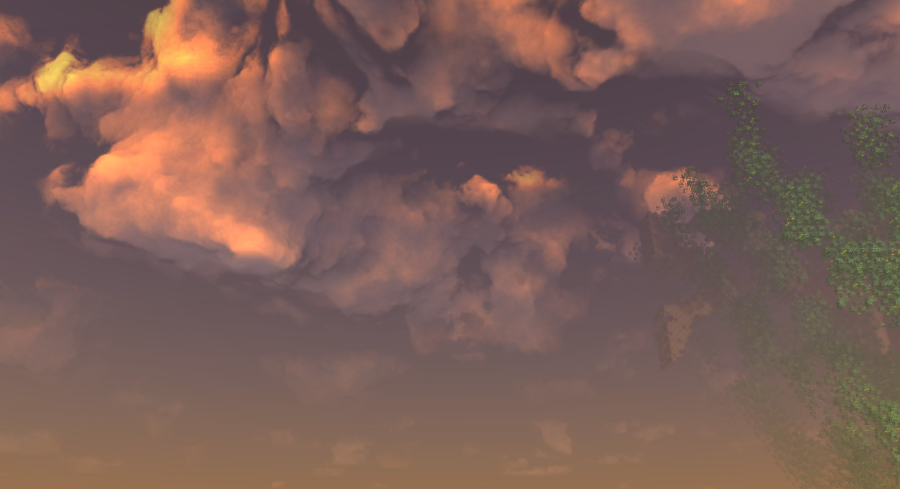 | 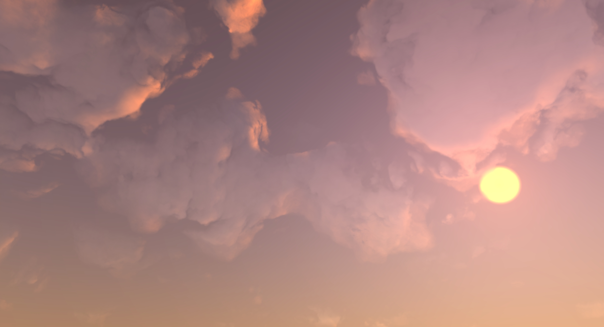
---|--- 

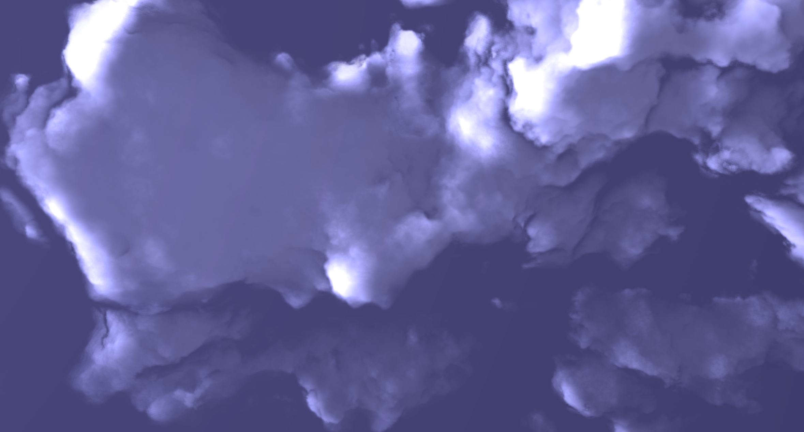 | 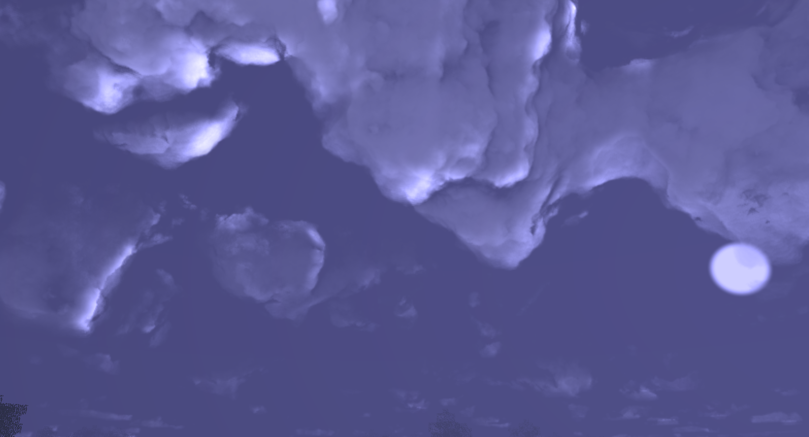
---|--- 

## Cascaded Shadow Maps
Implemented Cascaded Shadow Maps which use three shadow maps for different distance. The algorithm goes as follows:
* First, calculate the light depth map from the sun direction. We need first to split the light frustum into three layers using a mixed log and linear division. Then, from the center of the frustum, I calculate the minimum radius that a sphere can warp the frustum and get the orthogonal projection matrices that can project this sphere onto the screen.
* Second, render the light depth map. I used a texture array in OpenGL to achieve this. I used three draw calls each in each call, I just update the projection matrix of three frustum layers.
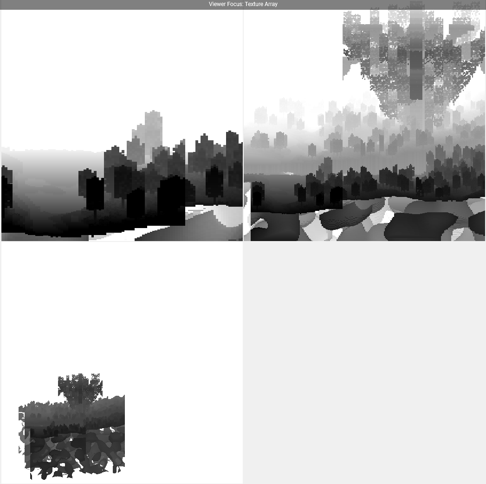
* Third, render the shadow map. For each fragment, I first test which layer it belongs to. Then, I project that point to light space using corresponding light projection matrix and compair its depth with the value stored in the light depth map. If the value is greater than light depth, the fragment will be in shaddow. Otherwise, it will be lit by the sun.\
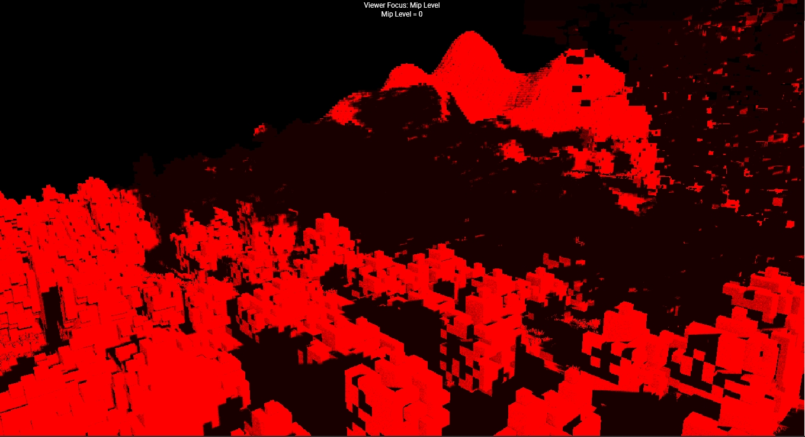
The shadow map will later be sent to the composite shader to compute the final color.\
This naive implementation brings many artifacts like shadow acne and shadow edge jittering. So, I used PCF to blur the edge of the shadow. Also, I set the resolution of the shadow map to the half of the screen size. Then, I used a bi-lateral filter to upsample it to futher blur it out. This has two advantages: 1. Less computation needed. 2. Better blurring effect.\
However, the jittering problem is still intractable. I posted this question on some forum and know that it is due to the dynamic light source. Increasing light depth map resolution is the ultimate solution but I cannot infinitely increase it. I'm still exploring efficient ways to resolve this issue.

## Volumetric Light
Volumetric Light is a huge booster for our final effect. It uses ray marching to calculate light density in the air. Actually, I think it is a by-product of shadow mapping since it depends on light depth maps and easy to implement. Here is how it works:
* First, in the fragment shader, I generate rays using camera position and value on position map. Then, I do ray marching along this ray.
* Second, in each step, I test if this sample point is exposed in the sun light just like what I did in CSM: Find corresponding layer, project to light space and compare. After going through all sample points, I will know the percentage of samples that are litted.
* Finally, I calculate the Mie term using ray direction and light direction so that when the player is looking at the sun, VL effect will be amplified.

The above implementation gives good result but we can still observe some layering artifacts, just like what we see in the volumetric cloud. So, the solution is the same: adding a noise for each ray. Then, the generated volumetric light map will be added to the image in the post-processing pipeline.
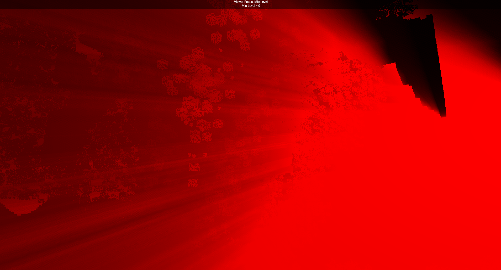

## Water Improvements

### Water Wave
I generated water waves using overlayed sine waves in random directions. The water offset and its normal can all be calculated from this map function. Since the derivate of sine is cose, we can calculate normals in an analytical way instead of sampling dx dy in a fragment.\
The amplitude and scale of the wave is deliberatly restrained since big wave harms the water reflection quality.

### Distance Based Alpha
I make the alpha of the water depends on the distance between water surface and riverbed. We can observe that the color of water is bluer when the river is deep and lighter when water is shallow. This improvement makes water more interesting and realistic. This is achieved by calculating the length between water fragment position and value on the position map. The alpha is then calculated using a curve function.
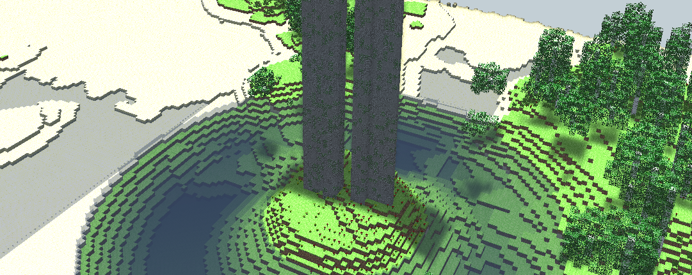

### Screen Space Reflection (SSR)
Implemented Screen Space Reflection that can trace the object in the screen space. Worked with fresnel shading to makes water more realistic.\
The algorithm goes like this:
* First, given a position map and camera position, I can calculate the view direction in world space. Given the normal of that fragment, I can calculate the ray direction.\
* Second, given the ray origin and ray direction, I do a ray marching on this ray for certain steps and test sample points' view space z component with depth buffer to check if the ray has entered any objects.\
* Third, if the ray intersects with something, I do a binary search to search the hit point as accurate as possible. If the hit point is found, get its color on the albedo map.
* If the ray goes out of the screen, I just clamp the point to screen space and sample the color on the sky map.

This implementation is simple and has acceptable outcome due to the simple game scene and the distortion of the water wave. But we can still see some artifacts at the edge of blocks due to the small thinkness. In the future, to further improve this, I may trace the ray in screen space instead of view space and use Hi-z to speed up ray marching.
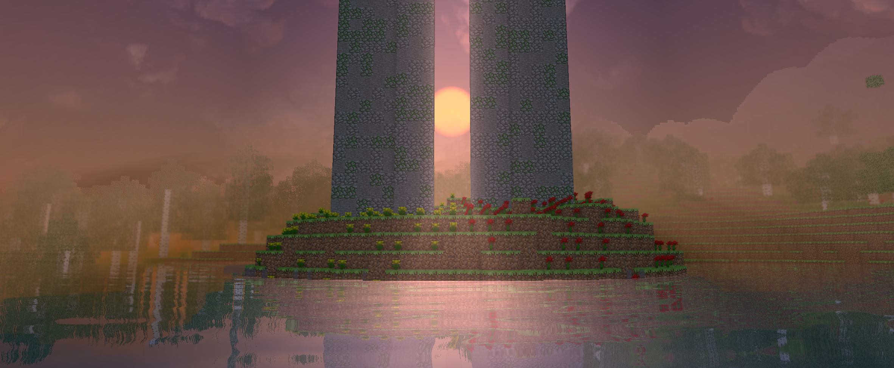

## Plants Rendering

### Plants Precise Shadow
The plants are drawn using two crossing faces and their shadow becomes ugly in this case. I discarded pixels with 0 alpha when rendering light depth map so that the shadow shape of plants is no more two polygons but precise plant shape.

### Plants Wave
A sine wave based plant waving. The difficulty is to only move top vertices and keep plants' root static. This is down by adding a flag in vertex attribute. I used the left-most bit of the block type as the flag and detect that flag in a vertex shader to find vertices that need to be shifted.

### Transparent Leaf
Since the provided texture do not have a transparent oak tree leaf, I simply did a clipping when the illuminance of a pixel on the texture image is below certain threshold. The problem is this clipping is temporary not supported by shadow mapping. Will working on it in the future.
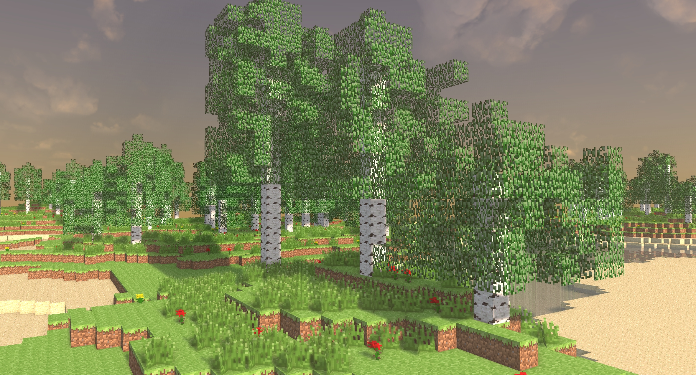

## Distance Fog
A distance fog implemented in composite shader. May overlapped with Jiangxu Xing's height fog, but they actually work well together. Implemented using a positino map and a customized decaying curve to control fog density based on distance between the object and the camera.\
A problem encountered is that when the fog is white, the distant object looks distinct from the sky. The solution is to choose fog color based on sky map. Another issue is that if we directly sample from sky map, the cloud will looks weired when overlapping with the terrain. So, a pure sky map and a sky map with cloud are produced simultaneously by the sky shader. (This improvement is actually done by Jiangxu Xing)

## Procedural Birch Forest
Based on Yueyang Li's terrain generator and util functions, implemented the logic of generating dense birch forest. Used ramdom tree height and added logic to avoid trees sticking together while preserving high tree density.
 | 
---|--- 

## Procedural Lake Sword
Just a cool stuff generated using some primitives like cubes, spheres, sine wave, smooth curve and so on. It is not integrated into the terrain generation system, so I bind a hotkey to summon the sword at player's position.\
I implemented functinos to draw boxes and spheres of different scales so that I can  generate the handle of the sword and blade of the sword.
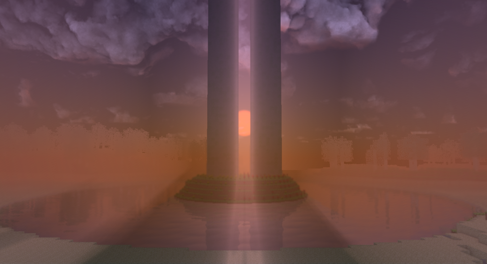 | 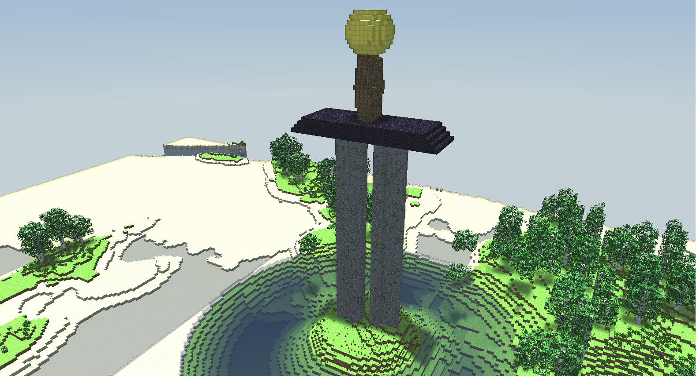
---|--- 


---
# Jiangxu Xing
## Frustum Culling
* Implemented the frustum based on the player's camera, prevent rendering cubes out of the frustum.

## Deferred Rendering Pipeline & Post-Processing Pipeline

### G-Buffer
* Participated in the construction of G-buffer
  * Include the calculation vertices' position, normal and save them into a buffer
* Helps me get enough data for these following screen-spaced effects

### Bilateral Filter
* Implemented the optimized blur algorithm based on both fragment's **position** and **intensity**
* Helps in denoising shadow maps, SSAO, and SSMS

### Screen Space Ambient Occlusion (SSAO)
* SSAO is intend to simulate ambient occlusion in screen space, the main logic behinds it is to sample in the **positive hemi-sphere** of every fragment to sense surrounding depth.
  * If surrounding fragments are closer to player, the target fragment will be darker.
* Accomplished in file `postSSAO.frag.glsl` 
* The data need for generating such an effect:
  1. The fragments' position map in view space
  2. The norm map in view space
  3. Random sample points and rotation factor
      * With different rotation factor in every fragment, I could generate different sampling using very small number of uniform sample points
* How it works for every fragment:
  1. Map uniform sample points to a hemi-sphere of the fragment based on its norm
     * Here is how the rotation factor make difference: **generating different sampling by rotating the hemi-sphere**
  2. Sampling surrounding fragments, count their depth
     * To make the occlusion more realistic, I introduced **weighted factor** based on the differentce of depth
  3. Output the final intensity into an **one-channel texture**. This texture will be used in the composite shading process to decide the final color of one fragment.

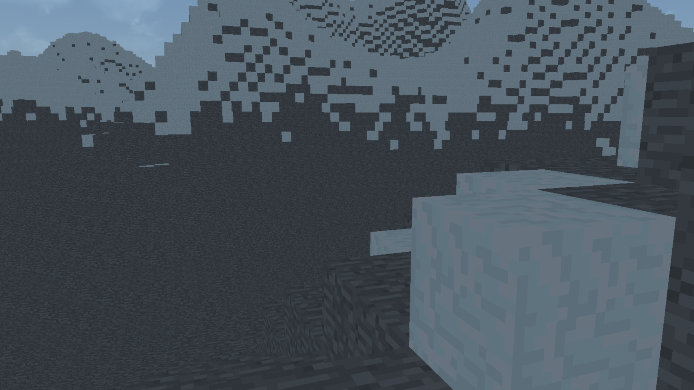 | 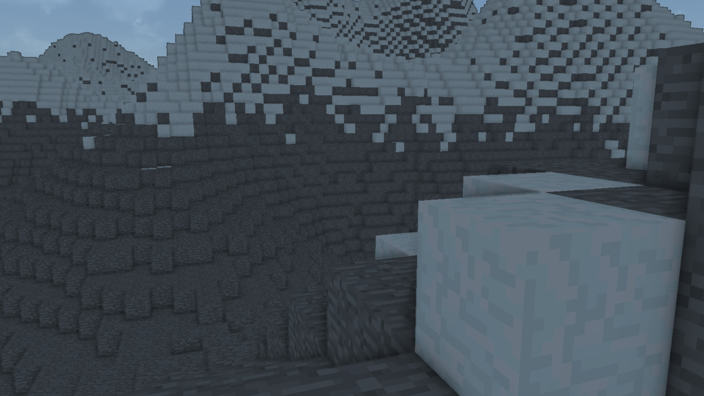
---|---

### Distance Fog & Height Fog 
* Mix the color of the fragment with the color of pure sky (no cloud)
  * This helps us make a smooth blend for the newly loaded terrain and the sky 
* Accomplished in file `postFogIntensity.frag.glsl`
* How it works
  * The logic behind distance fog is intuitive: use the depth of the fragment as the factor of intensity.
  * To generate height fog, I need to find the height of one fragment and compare it with the camera's height
  * Notice that height fog will only appear in the lower latitude.
* Animate fog based on time, the fog intensity will reach the maximum when day and night are interleaving.
* Note: In my solution, I output the fog intensity as one one-channel texture such that it could be used in the next SSMC step.

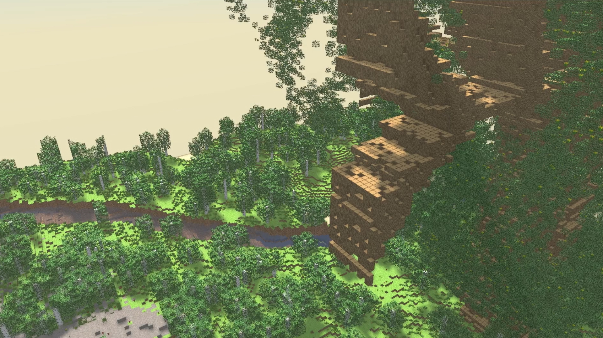 | 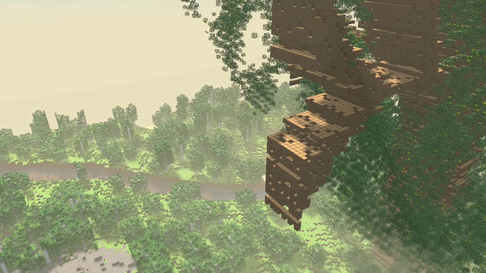 | 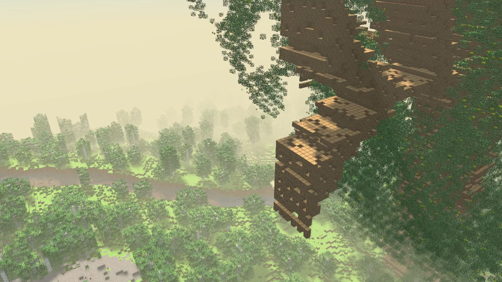
---|--- | ---

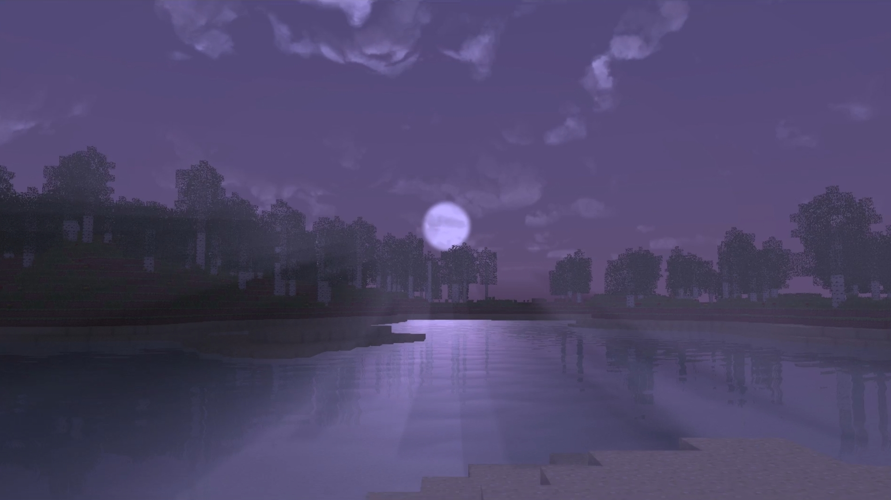 |  
---|--- 

### Screen Space Multiple Scattering (SSMC)

* SSMC powerfully simulates the scattered light in fogs under screen space, helps generate realistic and immersive vision under fogs
* Accomplished in file `postFog.frag.glsl`
* Data I need:
  * The albedo map from the previous render output (as it is a post-process)
  * The color map of the pure-sky to help get color
  * The fog intensity map generated in the previous step
* How it works:
  * Get fog intensity data from the intensity map, and calculate the fragment's tint color
  * Based on the magnitude of the fog-intensity, sample its neighbor.
    * The higher the intensity, the more neighbor it sampled
  * Mix the tint-color of the neighbor to current position to simulate scattering
    * I use **weighted bilateral filter** to mix the color.


 | 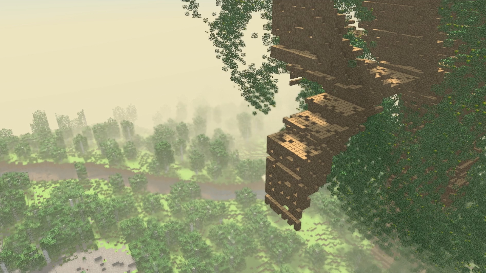
---|--- 

 | 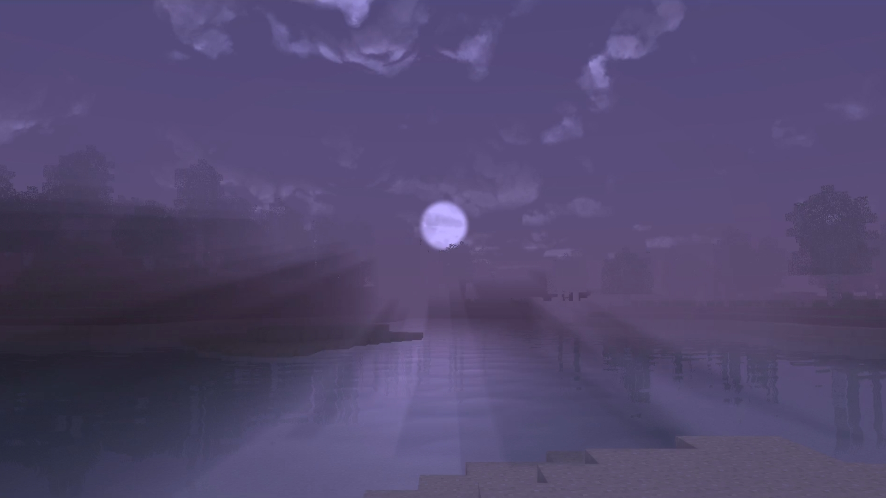
---|--- 
### Motion Blur
* Screen space velocity-based motion blur
  * I record the **camera's projection matrix in last frame**, and use this data to generate a velocity map. With such a map, I can calculate how fast player move in screen space. 
  * Apply simple **box blur**to accomplish the final blur.
* Refer last several secs in the demo video to see the effect

### Post-process sky integration
* Help Zhen Ren to separate sky pass into an independent texture and integrate it back as a post-process
* This helps make better translucent effect like **water & fog**, as they could get extra color from sky by accepting input sky texture

### More post-processing shader

* Intend to generate a comic-like view. 
* However, as these shaders are still under-development, they are not integrated to the current m3 render pipeline
* The reference link for a wondering comic-style shading: https://giedrejursenaite.portfoliobox.net/comicbookshader

#### Hatching
#### Bloom
#### Outline
#### Posterization

## Video recording Helper
* Add helper functions to help us record cinematic video
* Quick Keys:


### Photo Mode (KEY C)
* Have pretty low move/mouse sensitivity
* Similar to fly mode (no collision, no gravity), but will only move forward on x-z plane

### Adjusting rendering time scale
* Set up several presets of render time scale, which helps capture fantastic scenes

### Render pass breakdown (KEY 1)
* Change all shaders to support dynamic enable & disable
* Press the quick key will disable all shading features at once and enable them back separately in a preset order every 0.5s
* This helps a lot when recording breakdowns for the demonstration video

## Loading CG
* Set up logics to enable the CG in the initializing

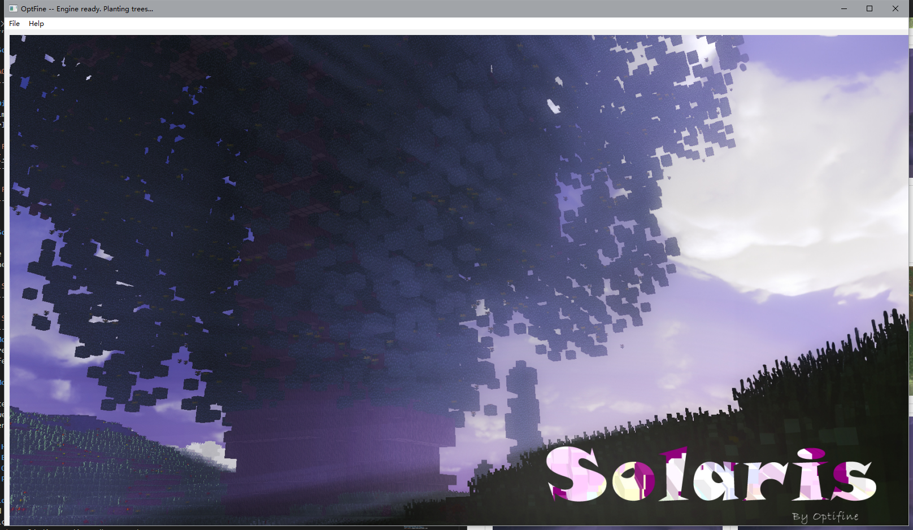

---
# Yueyang Li
## More Vibrant Ground Terrain Biome
Contributor:: **Yueyang Li**
I implemented the **third** and **fourth** Terrain biome, mainly the Desert and Oasis Land using a third and 
fourth noise function and blend it together with the first two noise functions using sin and cos blend techniques to make the transition look smooth and beautiful.
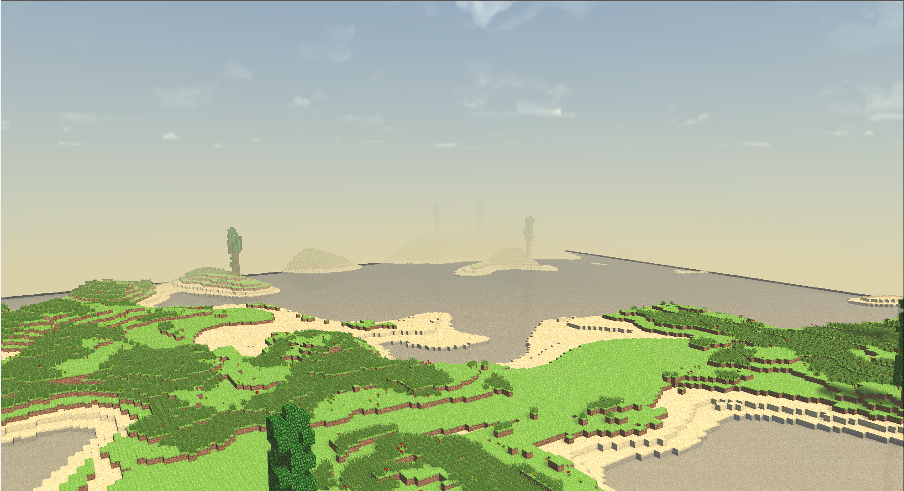

## L-system
Contributor:: **Yueyang Li**
### L-System Generated River
Using L-system logic, I generate a river that comprised of two lsystems that flows from east to west in the map. 
**first river**
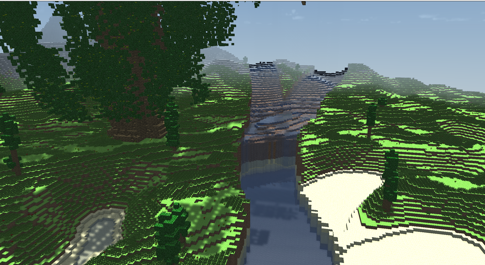
**second river**
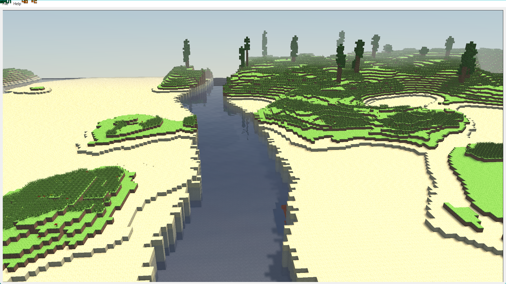


### L-system Generated Tree
In the center of the world, lay the elden Tree, where this tree is generated from a 2D L-system, and rotated and distorted to make for better visual effect
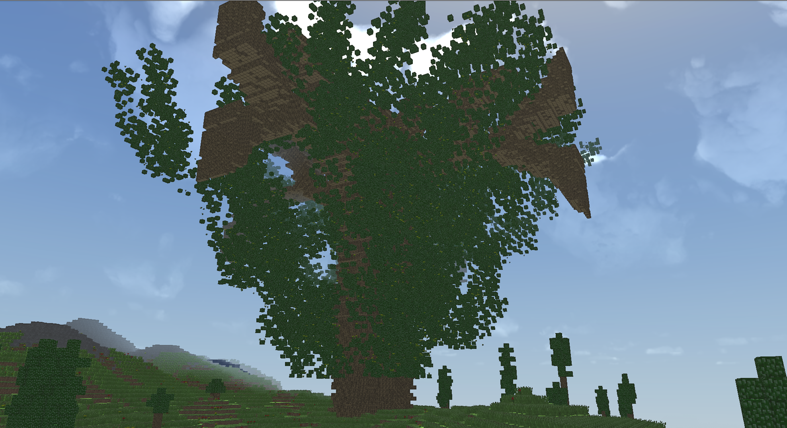

## Under Water and Lava Shader
Contributor:: **Yueyang Li**
I used worley and Perlin noise (tweaked and modified) to create under water and lava post-processing shader effect.
**Under Water Post-process shader**
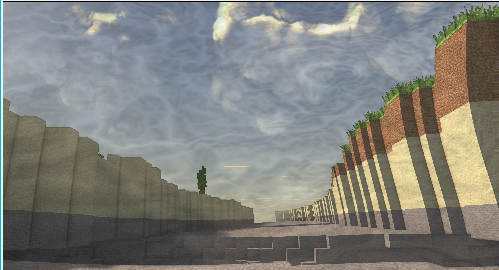

**Under Lava Post-process shader**
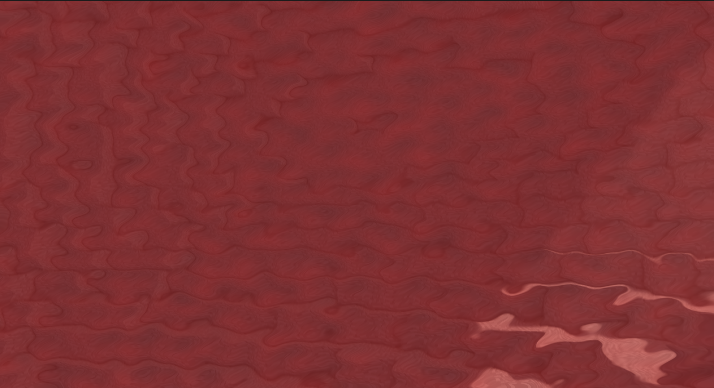

## Procedurally placed flowers and grass
Contributor:: **Yueyang Li**
I used worley and Perlin noise (tweaked and modified) to create under water and lava post-processing shader effect.
I used 2D Simplex noise to remap the placement of grass and flowers in the map, the final effect, as shown in the graph.
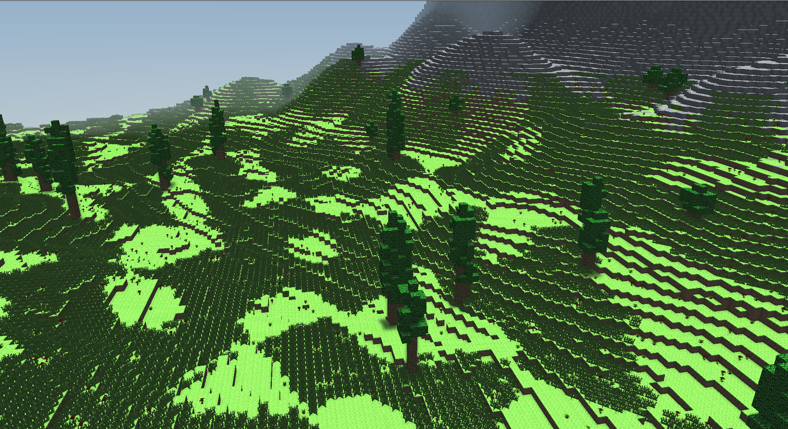

 ## Procedurally generated and placed trees, flowers, and other assets
Contributor:: **Yueyang Li**
 I used 3 noise functions to generate trees of different height, shape, and placements, the result could be examined as the eden-like grass land below. 
 I used 2 noise fucntions to distribute the flowers and grass, and 1 random generator to tweak the height and soil contraint of where the assets will be generated.
 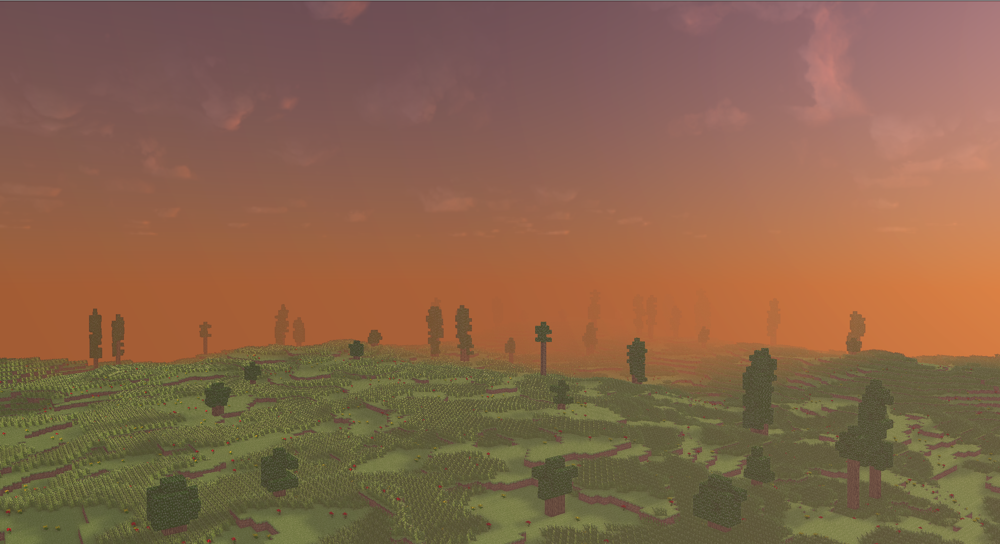

 ## 
